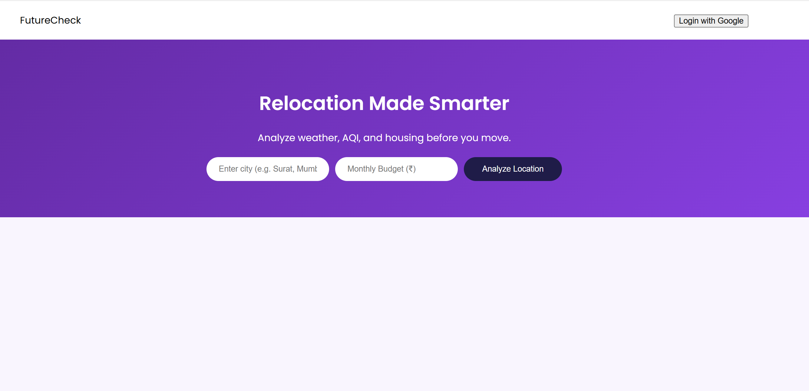
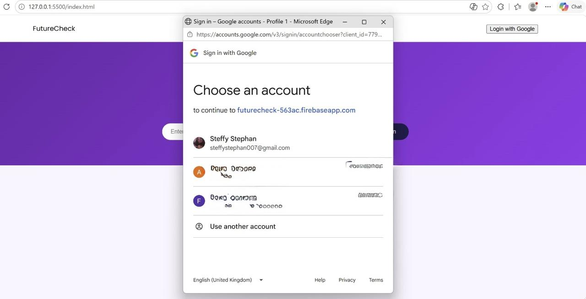
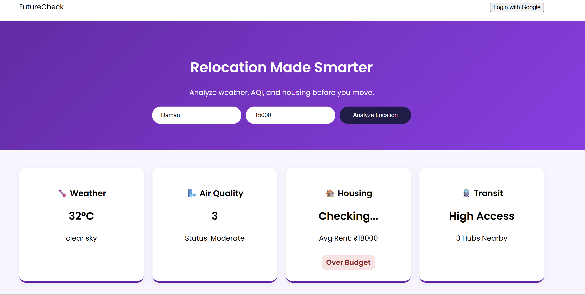
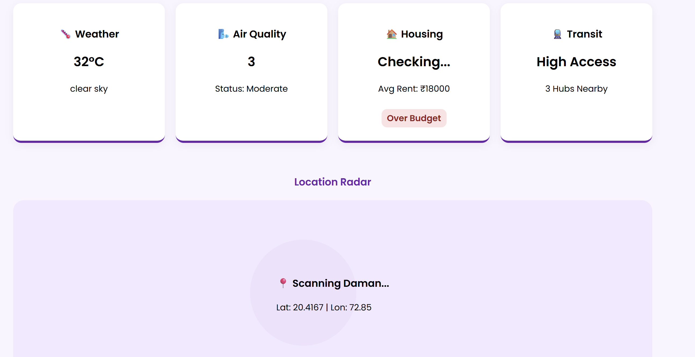

# FutureCheck | Relocation Intelligence Tool

FutureCheck is a web application designed to help users make informed decisions about relocating to new cities. It analyzes real-time weather, air quality (AQI), and housing budget feasibility.

## 🚀 Features
* **Google Authentication:** Secure login using Firebase Auth.
* **Real-time Weather & AQI:** Fetches data via OpenWeather API.
* **Budget Logic:** Intelligent budget checking for major Indian cities.
* **Location Radar:** Simulated scanning interface for urban facilities.

## 🛠️ Tech Stack
* **Frontend:** HTML5, CSS3 (Custom Purple Theme), JavaScript (ES6 Modules)
* **Backend/Auth:** Firebase
* **APIs:** OpenWeatherMap API

## 📸 App Walkthrough

### 1. Landing Page

### 2. Secure Authentication

### 3. Real-time Insights

### 4. Location Radar

